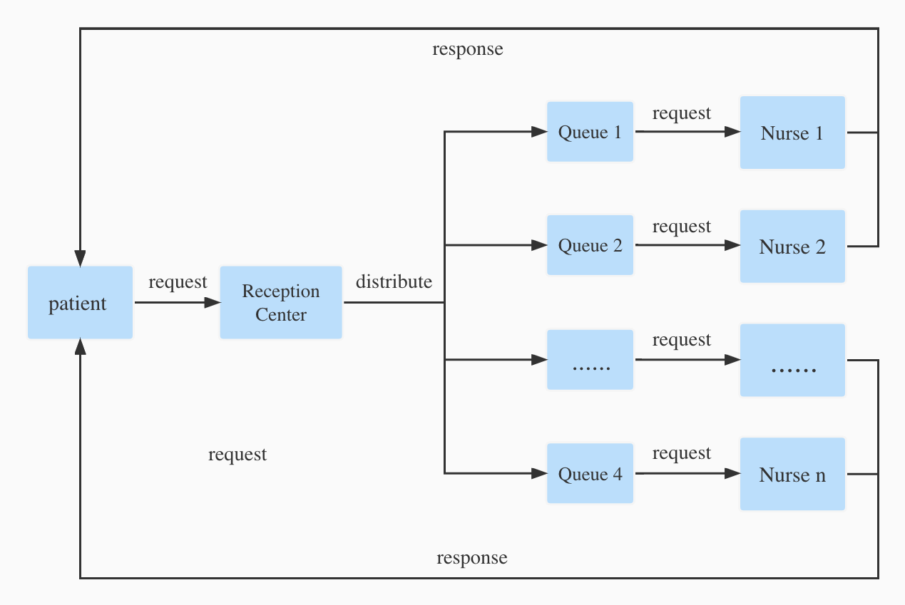
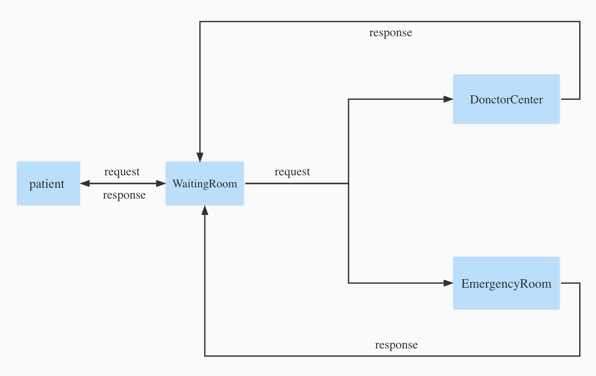

# Emergency-Simulator

## 1. Brève Introduction

// TODO 

Gitlab repository : [here](https://gitlab.utc.fr/wanhongz/emergency-simulator).

---

## 2. Quick Start

#### a. back-end

1. Clonez le code source du projet à partir du site officiel utc gitlab.

```shell
git clone https://gitlab.utc.fr/wanhongz/emergency-simulator.git
```

2. Basculez vers le répertoire racine du back-end du projet

```bash
cd YOUR_PATH_OF_THE_PROJET/back-end
```

3. Modifiez l'adresse IP et le Port de votre serveur dans le ficher **main.go** ( L'adresse par défaut est **"127.0.0.1:8082"** ).

4. Compilez avec la commande go build.

```go
go build
```

5. Ensuite, vous pouvez trouver l'exécutable **emergency-simulator** dans le répertoire racine du back-end, l'exécutez

```shell
./emergency-simulator
```

Normalement, vous devriez pouvoir voir l'invite indiquant que le projet démarre


#### b.front-end


## 3. Agents et ses interaction 

// TODO 解释agent1


<center class="half">         </center>

// TODO 解释agent2





## 4. Conception front-end


## 5. Le résultat de l'expérience


## 6. Résumé et Futur

