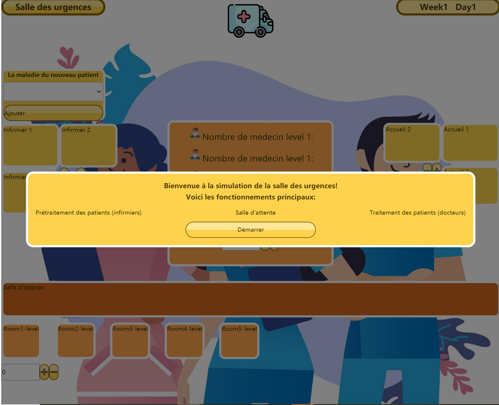

# Emergency-Simulator

## 1. Introduction

Dans le cadre de l'UV IA04, nous devons conçevoir et réaliser un projet de système de multi-agents.

#### Modélisation
L'objectif de ce projet est de modéliser une salle des urgences d'un centre hospitalier en se basant sur de différents types d'agents et de simuler leurs interactions. Dans le page web, le processus d'arrivée des patients à l'hôpital pour un traitement d'urgence peut être constaté d'une manière intuitive et interactive. 

#### Problématique
Quelle stratégie d'affectation des salles de consultation et des docteurs est la plus performante pour que le service des urgences soit le plus efficace possible?

#### Architecture
On utilise le langage GO pour construire la structure des agents du côté back-end, la communication entre les agents est réalisée par channel. La partie de front-end est effectuée par Vue.js. Plus de détails seront présentées dans les chapitres suivants.

Gitlab repository : [here](https://gitlab.utc.fr/wanhongz/emergency-simulator).

---

## 2. Quick Start

#### a. back-end

1. Clonez le code source du projet à partir du site officiel utc gitlab.

```shell
git clone https://gitlab.utc.fr/wanhongz/emergency-simulator.git
```

2. Basculez vers le répertoire racine du back-end du projet

```bash
cd YOUR_PATH_OF_THE_PROJET/back-end
```

3. Modifiez l'adresse IP et le Port de votre serveur dans le ficher **main.go** ( L'adresse par défaut est **"127.0.0.1:8082"** ).

4. Compilez avec la commande go build.

```go
go build
```

5. Ensuite, vous pouvez trouver l'exécutable **emergency-simulator** dans le répertoire racine du back-end, l'exécutez

```shell
./emergency-simulator
```

Normalement, vous devriez pouvoir voir l'invite indiquant que le projet démarre


#### b.front-end


## 3. Agents et ses interaction 

##### Agent Patient 

1. L'agent le plus important est aussi l'agent avec le plus de comportements, il a principalement les modèles de comportement suivants :

   1. Il attendra à l'entrée du bureau d'accueil de l'hôpital, expliquera sa situation, et attendra que l'infirmière lui donne un jugement préliminaire
   2. Faire la queue pour l'inscription
   3. Faites la queue dans la salle d'attente pour que le médecin appelle
   4. Traitement

##### Agent Nurse et Agent NurseCenter

L'agent utilisé pour assurer l'accueil et le diagnostic initial des patients :

1. NurseCenter est responsable du traitement des demandes des patients et de leur distribution aux infirmières
2. L'infirmière exécute la tâche après avoir reçu la demande
3. L'infirmière informe le patient après le travail

##### Agent Reception et Agent ReceptionCenter

Pour l'inscription des patients :

1. Il existe plusieurs files d'attente et le patient choisit activement l'une d'entre elles pour attendre
2. Le médecin agréé traite la demande d'inscription du patient afin
3. Une fois l'inscription terminée, le patient sera informé

<center class="half">         </center>

##### Agent WaitingRoom

Utilisé pour la gestion de l'attente une fois l'enregistrement du patient terminé

##### Agent DoctorCenter et Agent EmergencyRoomCenter

Ressources nécessaires pour les visites de patients :

1. DoctorCenter vérifie si un médecin est disponible
2. EmergencyRoomCenter vérifie s'il y a une salle de consultation disponible
3. Si tous sont satisfaits, commencez à voir le patient


## 4. Conception front-end
Il s'agit d'une application Web construite avec Vue.js, qui est principalement utilisée pour gérer les données transmises du backend et les présenter. 
 
Nous avons utilisé la fonctionnalité de liaison de données de réponse de Vue.js pour réaliser une mise à jour des données en temps réel et utilise des composants de vue pour composer la mise en page. 

En outre, il utilise également d'autres bibliothèques et plugins, tels qu'Axios et Vuex, pour réaliser l'acquisition et la gestion des données.



### Points forts de la conception du front

- Mise à jour de données en temps réel  
Pour ce faire, nous avons utilisé une option très pratique en Vue.js : _Life Cycle_. 
Ce sont des méthodes prédéfinies qui existe tout au long de l'application.  
Ici nous avons appliqué la fonction _mounted()_, elle s'effectue automatiquement quand l'élément DOM a été rendu dans la page.  
Dans la fonction nous utilisons _SetInterval_ pour effectuer la récuperation des données
## 5. Le résultat de l'expérience


## 6. Résumé et Futur

